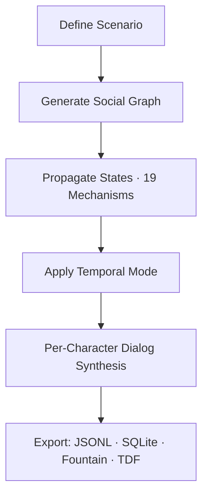
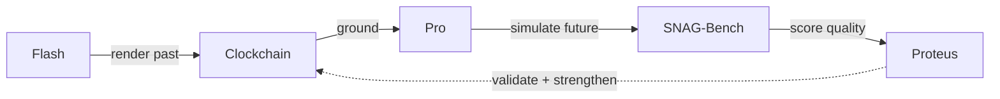

# Timepoint Pro Alpha

**Synthetic time travel through social simulation.**

**The first practical SNAG engine: Social Network Augmented Generation.**

Like RAG retrieves documents to ground generation, SNAG synthesizes and maintains a structured social graph---complete with causal provenance, knowledge flow, emotional states, and temporal consistency---to ground LLM generation in complex group dynamics.

This transforms LLMs from fragile, drifting storytellers into reliable multi-agent reasoners. Naive single-prompt simulations collapse beyond ~10 entities or ~20 interactions due to inconsistency and token explosion. SNAG's structured propagation, variable-depth fidelity, and composable mechanisms let you scale to dozens of entities across hundreds of timepoints---while keeping costs low and causality auditable.

The value is exponential with scale: the larger and more intricate the social system (board + investors + competitors, colony crew + Earth command, historical delegations), the more emergent behaviors surface that intuition or simple models miss. SNAG unlocks simulation of systems previously impossible with LLMs, enabling rigorous decision testing, strategic foresight, and high-quality training data at any scope.

Render any historical, present, or future social moment---like a synthesizer renders sound waves---with variable fidelity: coarse tensors for broad arcs, rich dialog only at critical pivots.

|                        | RAG                          | SNAG (this engine)                             |
|------------------------|------------------------------|------------------------------------------------|
| **Grounds LLMs in**   | Retrieved documents          | Synthesized social graphs                      |
| **Maintains**          | Document relevance           | Causal provenance + temporal consistency        |
| **Scales to**          | Millions of documents        | Dozens of entities, hundreds of timepoints      |
| **Output**             | Grounded answers             | Auditable causal simulations + training data    |

Costs: $0.15--$1.00 per run. All 21 templates verified Feb 16, 2026.

-> Full example run (every artifact): [EXAMPLE_RUN.md](EXAMPLE_RUN.md)
-> Sample dialogs and character arcs: [EXAMPLE_DIALOGS.md](EXAMPLE_DIALOGS.md)



## Quick Start
```bash
git clone https://github.com/timepoint-ai/timepoint-pro.git
cd timepoint-pro
pip install -r requirements.txt
export OPENROUTER_API_KEY=your_key
./run.sh list                            # All templates
./run.sh run mars_mission_portal         # PORTAL: backward from failed mission
./run.sh run castaway_colony_branching   # Full mechanisms + counterfactuals
```

## Core Capability: SNAG in Action
Define a scenario -> generate typed social graph -> propagate states -> explore temporal modes.

Flagship examples:
| Template                    | Mode      | Key Feature                          | Entities | Timepoints | Training Examples | Cost   |
|-----------------------------|-----------|--------------------------------------|----------|------------|-------------------|--------|
| mars_mission_portal         | PORTAL    | Backward reasoning from 2031 failure | 4        | 6          | 20                | ~$0.18 |
| castaway_colony_branching   | BRANCHING | Counterfactual survival strategies   | 8        | 16         | 120               | ~$0.35 |
| vc_pitch_branching          | BRANCHING | Investor reactions across pitches    | 5        | 16         | 60                | ~$0.30 |

## Why This Matters Now (and Even More Tomorrow)
- **Strategic foresight** --- PORTAL maps critical paths backward from any outcome ("$1B exit", "colony survives", "election won").
- **Decision testing** --- Run scenarios multiple ways, measure causal convergence, catch hidden propagation failures.
- **Physics-like social forecasting** --- Variable-depth fidelity treats social systems like physical ones: low-res for long horizons, high-res at pivot points.
- **Superior training data** --- Full causal ancestry, provenance, counterfactuals, quantitative states baked in.

## Rendered Futures

A Rendered Future is a scored, provenance-tracked causal subgraph — a structured projection of how the present connects to specific future states. Pro reads the Clockchain's Rendered Past as grounding and produces Rendered Futures as TDF records, creating a flywheel:

Flash renders the past → Clockchain stores it → Pro reads it as grounding, renders near-future causal paths → SNAG-Bench scores Causal Resolution → Proteus validates against reality → validated paths strengthen the Clockchain's Bayesian prior → all future renderings improve.



**Causal Resolution** = Coverage × Convergence. How much of a scenario has been rendered, and how reliably do repeated runs converge on the same causal structure?

The fidelity is asymptotic — we approach near-simulacrum on historical dialog because there are very few things a person *could* have said once the model has perfect context for that moment. We'll never reach 1.0, but we're at the steep end of the curve. And the further we render the past, the stronger the Bayesian prior for rendering the future.

The planned **Timepoint Futures Index (TFI)** will measure Rendered Past coverage and Rendered Future quality across the graph.

**Proof of Causal Convergence (PoCC)** is a future protocol concept: rendering convergent causal paths constitutes useful work. Multiple independent renderings that converge on the same causal structure provide a form of validation without ground truth. Pro and Clockchain are the natural anchors for this protocol.

## Temporal Modes
| Mode        | Causality Model                    | Best For                              | Example                      |
|-------------|------------------------------------|---------------------------------------|------------------------------|
| FORWARD       | Strict forward                     | Standard timelines                    | board_meeting                |
| PORTAL      | Backward from target               | Goal decomposition, critical paths    | mars_mission_portal          |
| BRANCHING   | Counterfactual branches            | "What if" analysis                    | castaway_colony_branching    |
| CYCLICAL    | Future constrains past             | Mythic loops, generational sagas      | agent4_elk_migration         |
| DIRECTORIAL | Dramatic tension drives events     | Story arcs                            | hound_shadow_directorial     |

PORTAL stands out: generates candidate antecedent states at each backward step, scores coherence with frontier models, delivers a queryable graph of pivots and constraints.

## Technical Foundations
- **Per-character dialog generation** --- Each character generates dialog turns via independent LLM calls with persona-derived generation parameters (temperature, top_p, max_tokens from entity state). A LangGraph steering agent (steering_node -> character_node -> quality_gate_node) selects speakers, manages narrative arc, and can suppress or end dialog.
- **Voice discipline and archetype profiles** --- 7-principle voice discipline block prevents AI-sounding output. 10 archetype rhetorical profiles (engineer, executive, military, scientist, politician, lawyer, diplomat, safety officer, doctor, journalist) with argument styles, disagreement patterns, and anti-exemplars. LLM-evaluated naturalness scoring, not hardcoded regex.
- **Params2Persona waveform** --- Entity tensor state (arousal, energy, behavior vector) maps to concrete LLM API parameters per turn. Aroused characters get higher temperature; fatigued characters get shorter responses; ADPRS phi scales all params.
- **Two-layer context (Fourth Wall)** --- Back layer shapes HOW a character speaks (true emotional state, withheld knowledge, suppressed impulses). Front layer provides WHAT they know (filtered knowledge, natural-language relationships). PORTAL mode strips knowledge from causally inaccessible timepoints.
- **Variable-depth fidelity** --- Most state compressed (~200 tokens); detail expands on demand. 95%+ token savings + physics-style abstraction.
- **SynthasAIzer waveform control** --- Timepoints rendered like sound: envelopes, gating, per-entity "voices."
- **Semantic quality gates** --- Three-level evaluation: per-dialog (narrative advancement, conflict specificity, voice distinctiveness), cross-dialog (progression between conversations), and full-run coherence. Surface heuristics filter first; frontier model evaluation runs on passes. Pattern-aware retry for anti-pattern turns.
- **Extended proception** --- Entities accumulate episodic memories, rumination topics, withheld knowledge, and suppressed impulses across dialogs. These feed back into future dialog generation.
- **19 composable mechanisms** --- Full spec in [MECHANICS.md](MECHANICS.md).
- **Planned: M20 Clockchain Grounding** --- Anchor simulations in the canonical temporal graph. Not yet implemented.
- **Convergence validation** --- Repeat runs, Jaccard on causal graphs -> reliability without labels.

Outputs: JSONL/SQLite for ML, TDF for suite interoperability, markdown/Fountain for humans, Oxen.ai auto-upload for versioning.

## Training Data & Model Licensing

If you intend to use simulation outputs as training data for fine-tuning, you **must** use models with licenses that permit it. Not all open-source models allow unrestricted use of their outputs for training.

| License | Models | Training Data Status |
|---------|--------|---------------------|
| **MIT** | DeepSeek Chat, DeepSeek R1 | Fully unrestricted --- outputs can train any model |
| **Apache 2.0** | Mistral 7B, Mixtral 8x7B, Mixtral 8x22B | Fully unrestricted --- outputs can train any model |
| **Llama** | Llama 3.1 8B/70B/405B, Llama 4 Scout | **Restricted** --- Meta's license prohibits using Llama outputs to train non-Llama models |
| **Qwen** | Qwen 2.5 7B/72B, QwQ 32B | Permissive for most uses |

**Default behavior:** The model selector (`M18`) automatically filters to training-safe models (MIT/Apache-2.0) when `for_training_data=True`. When `OXEN_API_KEY` is set, training data upload uses this filter.

Training data is also valuable for fine-tuning causal reasoning and roleplay models, and as an end-state goal, training diffusion models conditioned on temporal causal graphs.

**If you plan to fine-tune a non-Llama model** (e.g., Qwen, Mistral, or a custom model), ensure your simulation runs use only MIT or Apache-2.0 licensed models: `./run.sh run --model deepseek/deepseek-r1 your_template`

## Use Cases Today
- Corporate strategy & crisis simulation
- Policy, history, and historical counterfactuals
- Fine-tuning for causal/temporal/multi-agent reasoning
- Research platform for social physics
- Grounding data for autonomous AI agent swarms
- Composable data assets for the Clockchain

## Architecture: Isolation by Design

Timepoint Pro is a **standalone simulation engine**. It has no runtime dependencies on Flash, Billing, Clockchain, or any other Timepoint Suite service. All LLM calls go directly to OpenRouter. All data stays in local SQLite + flat files.

This is intentional: the public repo must remain forkable and self-contained. Anyone with an OpenRouter key can run the full pipeline.

**Recent:** TDF export format via `ExportFormatFactory`. Data export API (`/api/data-export/{run_id}`).

**Planned: `/api/data-export`** --- A future endpoint for bulk export of simulation artifacts (causal graphs, entity tensors, dialog corpora, convergence sets) in standardized formats. Primary consumers: SNAG-Bench Axis 2 (causal reasoning benchmarks) and Proteus (simulation-to-training pipeline). This endpoint will live in the dashboard API (`dashboards/api/server.py`) and serve read-only data from the existing runs database. No auth required for local use; the Pro-Cloud private wrapper will gate access through its own auth layer.

**Pro-Cloud boundary** --- `/api/usage` and `/api/budget` are not implemented here. These endpoints live in the Pro-Cloud private wrapper, which tracks usage locally (per-run `UsageRecord` table) and optionally forwards to the shared Billing service when `BILLING_SERVICE_URL` is configured. This repo exposes simulation data only.

## Cloud Execution via Pro-Cloud

For long-running simulations and persistent storage, a private hosted layer wraps this engine with production concerns:

- **Persistent storage** --- Postgres replaces SQLite; results survive deploys
- **Job queue** --- Celery + Redis for cancellable, deploy-surviving jobs
- **Auth** --- JWT + API key with Postgres persistence (this repo's in-memory key scaffold is for local dev only)
- **Budget enforcement** --- Pre-submission budget checks, per-run cost tracking, optional forwarding to shared Billing service
- **Usage tracking** --- `UsageRecord` table records every run start/complete with cost and token counts
- **Railway deployment** --- Internal networking to Billing, Auth, and Web services

The cloud layer includes this repo as a git submodule and adds no runtime dependencies back into it. See the engine's API for simulation data; the cloud layer gates access and adds `/api/usage` + `/api/budget` endpoints.

## Sample Training Data

A small sample JSONL file is included at [`examples/sample_training_data.jsonl`](examples/sample_training_data.jsonl). Each line is a prompt/completion pair generated from a PORTAL mode simulation (backward reasoning from a fixed future state). The format demonstrates the structured context (M3 knowledge provenance, M6 entity state, M7 causal history, M10 atmosphere, M11 dialog context, M13 relationships) that makes SNAG training data uniquely rich.

## Documentation
- [EXAMPLE_RUN.md](EXAMPLE_RUN.md) --- complete walkthrough
- [MECHANICS.md](MECHANICS.md) --- all 19 mechanisms
- [SYNTH.md](SYNTH.md) --- synthesizer paradigm details
- [QUICKSTART.md](QUICKSTART.md) --- full setup

## Timepoint Suite

Open-source engines for temporal AI. Render the past. Simulate the future. Score the predictions. Accumulate the graph.

| Service | Type | Repo | Role |
|---------|------|------|------|
| **Flash** | Open Source | timepoint-flash | Reality Writer — renders grounded historical moments (Synthetic Time Travel) |
| **Pro** | **Open Source** | **timepoint-pro** | **Rendering Engine — SNAG-powered simulation, TDF output, training data** |
| **Clockchain** | Open Source | timepoint-clockchain | Temporal Causal Graph — Rendered Past + Rendered Future, growing 24/7 |
| **SNAG Bench** | Open Source | timepoint-snag-bench | Quality Certifier — measures Causal Resolution across renderings |
| **Proteus** | Open Source | proteus | Settlement Layer — prediction markets that validate Rendered Futures |
| **TDF** | Open Source | timepoint-tdf | Data Format — JSON-LD interchange across all services |
| **Web App** | Private | timepoint-web-app | Browser client at app.timepointai.com |
| **iPhone App** | Private | timepoint-iphone-app | iOS client — Synthetic Time Travel on mobile |
| **Billing** | Private | timepoint-billing | Payment processing — Apple IAP + Stripe |
| **Landing** | Private | timepoint-landing | Marketing site at timepointai.com |

**The Timepoint Thesis** — a forthcoming paper formalizing the Rendered Past / Rendered Future framework, the mathematics of Causal Resolution, the TDF specification, and the Proof of Causal Convergence protocol. Follow [@seanmcdonaldxyz](https://x.com/seanmcdonaldxyz) for updates.

## Author

**Sean McDonald** ([@seanmcdonaldxyz](https://x.com/seanmcdonaldxyz) · [realityinspector](https://github.com/realityinspector))

License: Apache 2.0
Models: open-weight models via OpenRouter for simulation (see Training Data & Model Licensing for restrictions); commercial frontier models for coding, documented in git commit history.
